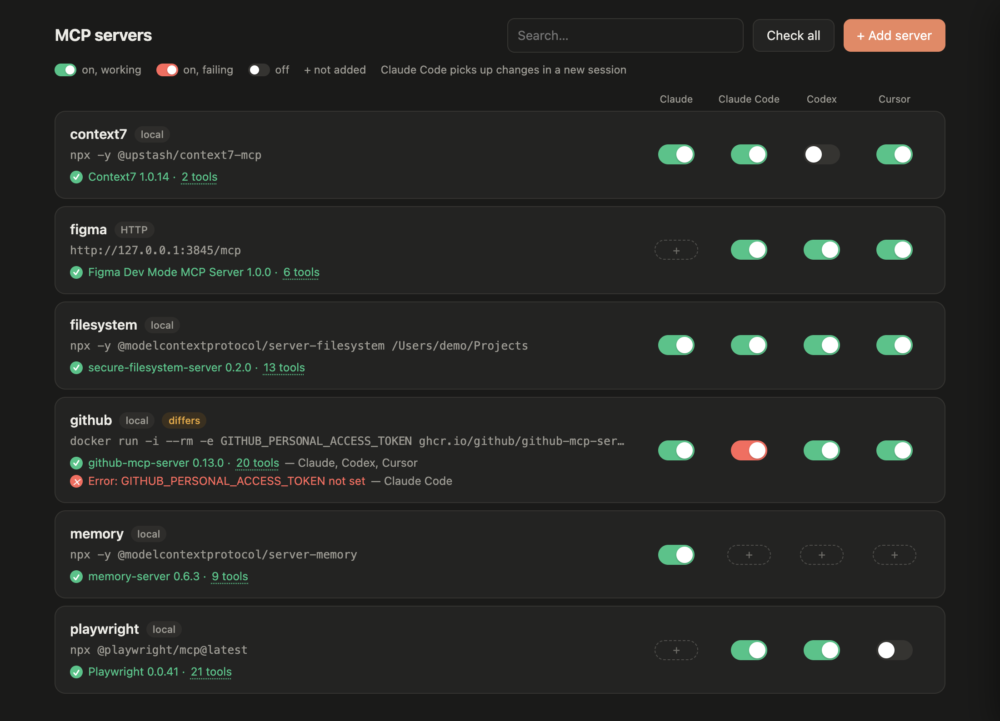
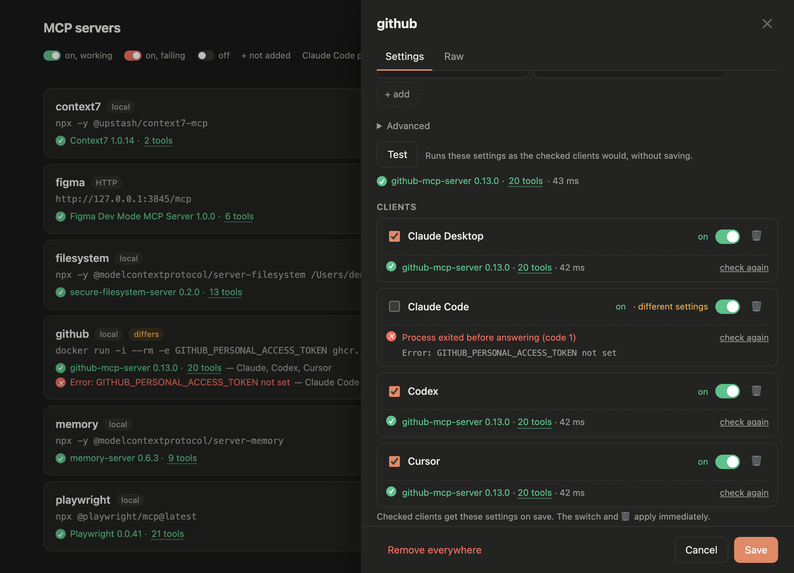

<div align="center">

# mcp-manager

All your MCP servers from **Claude Desktop**, **Claude Code**, **Codex** and **Cursor** on one local page.




</div>

## Features

- **Toggle per client** — turn any server on or off in Claude Desktop, Claude Code, Codex or Cursor.
- **Health check** — green works, red is broken. Hover to see its tools or the error. Test new settings before saving them.
- **Edit once** — change a server in one form and save it to every client.
- **Restart prompt** — know when Claude Desktop or Codex needs a restart to pick up changes.

<p align="center"></p>

## Quick start

Requires macOS and Node.js 18+.

```bash
npx -y github:iceer101/mcp-manager
```

It starts in the background and opens http://localhost:4717. Running it again restarts it, so an updated version takes over. It stops by itself after 10 idle minutes, or right away with:

```bash
npx github:iceer101/mcp-manager --stop
```

From a clone, the same is `npm start` and `npm stop`.

## Good to know

- Everything stays on your machine; the page is reachable only from this computer.
- Every change is backed up to `~/.mcp-manager` first.
- Turning a server off keeps its settings, so you can turn it back on later.

## License

[MIT](LICENSE). Third-party licenses for the bundled `mcp-remote`: [vendor/mcp-remote.LICENSES.txt](vendor/mcp-remote.LICENSES.txt).
